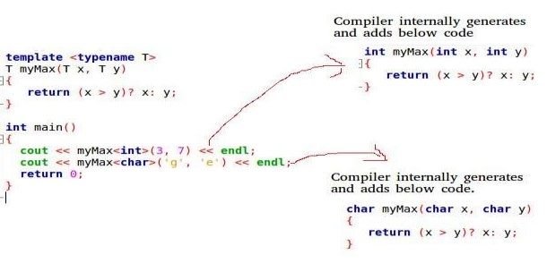

## EXPERIMENT NO - 14

**Title:** Write a program to implement function template.

**Objectives:** To write a generic function.

**Key Concepts:** template, function template, typename, class

**Theory:**
**Templates in C++**

Template is simple and yet very powerful tool in C++. The simple idea is to pass data type as a
parameter so that we don’t need to write same code for different data types. For example a software
company may need sort() for different data types. Rather than writing and maintaining the multiple
codes, we can write one sort() and pass data type as a parameter.

C++ adds two new keywords to support templates: ‘template’ and ‘typename’. The second
keyword can always be replaced by keyword ‘class’.

**How templates work?**

Templates are expended at compiler time. This is like macros. The difference is, compiler does
type checking before template expansion. The idea is simple, source code contains only
function/class, but compiled code may contain multiple copies of same function/class.

**Function Templates We write a generic function that can be used for different data types.**

**Problem Statement:**

    Write a program to implement linear search using function template.

**Program Analysis:**

- Write a function template for linear search.
- Pass the searching element and input array to the function as parameter.
- Write a searching logic inside function if element found return the flag.
- Test the program for different datatypes
