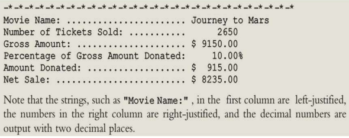

## EXPERIMENT NO - 2

**Title**: Write a program to make a use of manipulators in C++.

**Objectives**:

1. To understand the use of different manipulators.

   **Key Concepts**: manipulators

   **Theory**:
   Manipulators are helping functions that can modify the input/output stream. It does not mean
   that we change the value of a variable, it only modifies the I/O stream using insertion (<<) and
   extraction (>>) operators.

   **Types of Manipulators**
   There are various types of manipulators:

1. **Manipulators without arguments**: The most important manipulators defined by the

   **IOStream library** are provided below.

- **endl**: It is defined in ostream. It is used to enter a new line and after entering a
  new line it flushes (i.e. it forces all the output written on the screen or in the file)
  the output stream.
- **ws**: It is defined in istream and is used to ignore the whitespaces in the string
  sequence.
- **ends**: It is also defined in ostream and it inserts a null character into the output
  stream. It typically works with std::ostrstream, when the associated output buffer
  needs to be null-terminated to be processed as a C string.
- **flush**: It is also defined in ostream and it flushes the output stream i.e. it forces all
  the output written on the screen or in the file. Without flush, the output would be
  the same but may not appear in real-time.

2. **Manipulators with Arguments**: Some of the manipulators are used with the argument
   like setw (20), setfill (‘\_’) and many more. These all are defined in the header file. If we
   want to use these manipulators then we must include this header file in our program.

   For Example, you can use following manipulators to set minimum width and fill the empty
   space with any character you want: std::cout << std::setw (6) << std::setfill (’\_’);

**Some important manipulators in \< iomanip \> are**:

- **setw (val)**: It is used to sets the field width in output operations.
- **setfill (c)**: It is used to fill the character ‘c’ on output stream.
- **setprecision (val)**: It sets val as the new value for the precision of floating-point values.
- **setbase(val)**: It is used to set the numeric base value for numeric values.
- **setiosflags(flag)**: It is used to sets the format flags specified by parameter mask.
- **resetiosflags(m)**: It is used to resets the format flags specified by parameter mask.

**Some important manipulators in \<ios\> are:**

- **showpos**: It forces to show a positive sign on positive numbers.
- **noshowpos**: It forces not to write a positive sign on positive numbers.
- **showbase**: It indicates numeric base of numeric values.
- **uppercase**: It forces uppercase letters for numeric values.
- **nouppercase**: It forces lowercase letters for numeric values.
- **fixed**: It uses decimal notation for floating-point values.
- **scientific**: It use scientific floating-point notation.
- **hex**: Read and write hexadecimal values for integers and it works same as the setbase(16).
- **dec**: Read and write decimal values for integers i.e. setbase(10).
- **oct**: Read and write octal values for integers i.e. setbase(10).
- **left**: It adjust output to the left.
- **right**: It adjust output to the right.

### Example :

```c
#include <iomanip>
#include <iostream>
using namespace std;
int main()
{
    double A = 100;
    double B = 2001.5251;
    double C = 201455.2646;
    // We can use setbase(16) here instead of hex
    // formatting
    cout << hex << left << showbase << nouppercase;
    // actual printed part
    cout << (long long)A << endl;
    // We can use dec here instead of setbase(10)
    // formatting
    cout << setbase(10) << right << setw(15)
    << setfill('_') << showpos
    << fixed << setprecision(2);
    // actual printed part
    cout << B << endl;
    // formatting
    cout << scientific << uppercase
    << noshowpos << setprecision(9);
    // actual printed part
    cout << C << endl;
}
```

### Problem Statement:

Movie Tickets Sale and Donation to Charity

- A movie in a local theater is in great demand. To help a local charity, the theater
  owner has decided to donate to the charity a portion of the gross amount generated
  from the movie. This example designs and implements a program that prompts the
  user to input the movie name, adult ticket price, child ticket price, number of adult
  tickets sold, number of child tickets sold, and percentage of the gross amount to be
  donated to the charity. The output of the program is as follows.

  

### Program Analysis:

**Input**: The input to the program consists of the movie name, adult ticket price, child ticket price, number of adult tickets sold, number of child tickets sold, and percentage of the gross amount to be donated to the charity.

**Output**: The output is as shown above.

**[Solution](#Solution-in-a-single-file)** (In a single file)

**[Solution](#Solution-in-seprate-files)** (In seprate files)

- [main.cpp](#main.cpp)
- [movieHouse.h](#movieHouse.h)
- [movieHouseOperations.h](#movieHouseOperations.h)
- [movieHouseOperations.cpp](#movieHouseOperations.cpp)

# Solutions

### Solution in a single file

```c
#include <iostream>
#include <iomanip>
using namespace std;

int main()
{
	string movieName;
	float adultTicketPrice, childTicketPrice, grossAmount, donationPercentage, netAmount, donation;
	int adultTicketsSold, childTicketsSold, totalTicketsSold;
	cout << "Enter Movie Name : ";
	getline(cin, movieName);
	cout << "\nAdult Ticket Price : ";
	cin >> adultTicketPrice;
	cout << "\nChild Ticket Price : ";
	cin >> childTicketPrice;
	cout << "\nAdult Tickets sold : ";
	cin >> adultTicketsSold;
	cout << "\nChild Tickets sold : ";
	cin >> childTicketsSold;
	cout << "\nDonation Percentage (%) : ";
	cin >> donationPercentage;

	grossAmount = (adultTicketPrice * adultTicketsSold) + (childTicketPrice * childTicketsSold);
	donation = (grossAmount * donationPercentage) / 100;
	netAmount = grossAmount - donation;
	totalTicketsSold = adultTicketsSold + childTicketsSold;

	for (int i = 0; i < 30; i++)
		cout << "_*";

	cout << endl
		 << endl
		 << setw(40) << setfill('.') << left << "Movie Name: ";
	cout << setw(11) << setfill(' ') << right << movieName;

	cout << endl
		 << setw(40) << setfill('.') << left << "Number of Tickets Sold: ";
	cout << setw(11) << setfill(' ') << right << totalTicketsSold;

	cout << endl
		 << setw(40) << setfill('.') << left << "Gross Amount: ";
	cout << '$' << setw(10) << setfill(' ') << right << fixed << setprecision(2) << grossAmount;

	cout << endl
		 << setw(40) << setfill('.') << left << "Percentage of Gross Amount Donated: ";
	cout << '$' << setw(10) << setfill(' ') << right << donationPercentage << "%";

	cout << endl
		 << setw(40) << setfill('.') << left << "Amount Donated: ";
	cout << '$' << setw(10) << setfill(' ') << right << donation;

	cout << endl
		 << endl
		 << setw(40) << setfill('.') << left << "Net Sale: ";
	cout << '$' << setw(10) << setfill(' ') << right << netAmount;

	cout << endl
		 << endl;
}

```

### Solution in seprate files

##### [main.cpp](main.cpp)

```c
#include "movieHouse.h"
#include "movieHouseOperations.h"
#include "malloc.h"

int main(){
    struct MovieHouse *movieHouse;
    movieHouse=(struct MovieHouse*)malloc(sizeof(struct MovieHouse));
    setMovieHouseData(movieHouse);
    generateReport(*movieHouse);
}
```

##### [movieHouse.h](movieHouse.h)

```c
using namespace std;
struct MovieHouse{
    char movieName[100];
	float adultTicketPrice,childTicketPrice,grossAmount,donationPercentage,netAmount,donation;
	int adultTicketsSold,childTicketsSold,totalTicketsSold;
};
```

##### [movieHouseOperations.h](movieHouseOperations.h)

```c
void setMovieHouseData(struct MovieHouse*);
void generateReport(struct MovieHouse);

```

##### [movieHouseOperations.cpp](movieHouseOperations.h)

```c
#include <iostream>
#include <iomanip>
#include <cstdlib>
#include "movieHouse.h"
using namespace std;
void setMovieHouseData(struct MovieHouse* movieHouse){
    system("clear");
	cout<<"Enter Movie Name : ";
	cin.getline(movieHouse->movieName,100);
	cout<<"\nAdult Ticket Price : ";
	cin>>movieHouse->adultTicketPrice;
	cout<<"\nChild Ticket Price : ";
	cin>>movieHouse->childTicketPrice;
	cout<<"\nAdult Tickets sold : ";
	cin>>movieHouse->adultTicketsSold;
	cout<<"\nChild Tickets sold : ";
	cin>>movieHouse->childTicketsSold;
	cout<<"\nDonation Percentage (%) : ";
	cin>>movieHouse->donationPercentage;
}
void generateReport(struct MovieHouse movieHouse){

    system("clear");

	movieHouse.grossAmount=(movieHouse.adultTicketPrice*movieHouse.adultTicketsSold)+(movieHouse.childTicketPrice* movieHouse.childTicketsSold);
	movieHouse.donation=(movieHouse.grossAmount*movieHouse.donationPercentage)/100;
	movieHouse.netAmount=movieHouse.grossAmount-movieHouse.donation;
	movieHouse.totalTicketsSold=movieHouse.adultTicketsSold+movieHouse.childTicketsSold;

	for(int i=0;i<25;i++)
	cout<<"_*";

	cout<<endl<<endl<<setw(40)<<setfill('.')<<left<<"Movie Name: ";
	cout<<setw(11)<<setfill(' ')<<right<<movieHouse.movieName;

	cout<<endl<<setw(40)<<setfill('.')<<left<<"Number of Tickets Sold: ";
	cout<<setw(11)<<setfill(' ')<<right<<movieHouse.totalTicketsSold;

	cout<<endl<<setw(40)<<setfill('.')<<left<<"Gross Amount: ";
	cout<<'$'<<setw(10)<<setfill(' ')<<right<<fixed<<setprecision(2)<<movieHouse.grossAmount;

	cout<<endl<<setw(40)<<setfill('.')<<left<<"Percentage of Gross Amount Donated: ";
	cout<<'$'<<setw(10)<<setfill(' ')<<right<<movieHouse.donationPercentage<<"%";

	cout<<endl<<setw(40)<<setfill('.')<<left<<"Amount Donated: ";
	cout<<'$'<<setw(10)<<setfill(' ')<<right<<movieHouse.donation;

	cout<<endl<<endl<<setw(40)<<setfill('.')<<left<<"Net Sale: ";
	cout<<'$'<<setw(10)<<setfill(' ')<<right<<movieHouse.netAmount;

	cout<<endl<<endl;

	for(int i=0;i<25;i++)
		cout<<"_ ";
	cout<<endl;
	for(int i=0;i<25;i++)
		cout<<" *";
	cin>>movieHouse.movieName;
	system("clear");

}
```
