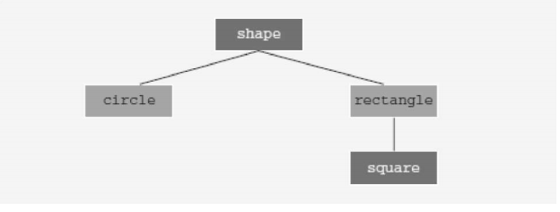

## EXPERIMENT NO - 6

**Title**: : Write a program to implement Inheritance and Composition (Aggregation)

**Objectives**:

1. To understand the concept of inheritance.

2. To understand the concept of Composition(Aggregation)

**Key Concept**: Inheritance, Composition, Aggregation

**Theory:**

**Inheritance** means, create new classes from existing classes. The new classes that we
create from the existing classes are called the Derived classes; the existing classes are called the Base classes.

The derived classes inherit the properties of the Base classes. So rather than create
completely new classes from scratch, we can take advantage of inheritance and reduce software
complexity.

Each derived class, in turn, becomes a base class for a future derived class. Inheritance
can be either single inheritance or multiple inheritance. In single inheritance, the derived class is derived from a single base class. In multiple inheritance, the derived class is derived from more than one base class.

Inheritance can be viewed as a tree-like, or hierarchical, structure wherein a base class is
shown with its derived classes.

Consider the tree diagram shown in Figure



In this diagram, shape is the base class. The classes circle and rectangle are derived from shape, and the class square is derived from rectangle. Every circle and every rectangle is a shape. Every square is a rectangle.

The general syntax of a derived class is:

```c++
class className: memberAccessSpecifier baseClassName
{
member list
};
```

in which memberAccessSpecifier is public, protected, or private.

When no memberAccessSpecifier is specified, it is assumed to be a private inheritance.

_**Rules for base and the derived classes**_

1. The private members of a base class are private to the base class; hence, the members of
   the derived class cannot directly access them.
2. The public members of a base class can be inherited either as public members or as
   private members by the derived class.
3. The derived class can include additional members - data and/or functions.
4. The derived class can redefine(Overriding) the public member functions of the base class.
   However, this redefinition applies only to the objects of the derived class, not to the
   objects of the base class.
5. All member variables & member functions(Overriding type) of the base class are also
   member variables & member functions of the derived class.

In general, while writing the definitions of the member functions of a derived class to specify a call to a public member function of the base class, we do the following:

- If the derived class overrides a public member function of the base class, then to specify a call to that public member function of the base class, you use the name of the base class, followed by the scope resolution operator _(::)_ followed by the function name with the appropriate parameter list.

- If the derived class does not override a public member function of the base class, you may specify a call to that public member function by using the name of the function and the appropriate parameter list.

**Constructors of Derived and Base Classes**

Suppose that a baseClass, has private member variables and constructors.

Further suppose that the class derivedClass is derived from baseClass, and derivedClass has no member variables. Therefore, the member variables of derivedClass are the ones inherited from baseClass.

A constructor (with parameters) of derivedClass merely issues a call to a constructor (with
parameters) of baseClass. Therefore, while writing the definition of the constructor (with
parameters) of derivedClass, the heading of the definition of the constructor contains a call to an
appropriate constructor (with parameters) of baseClass, and the body of the constructor is
empty—that is, it contains only the opening and closing braces.

**Destructors in a Derived Class**

Destructors are typically used to deallocate dynamic memory allocated by the objects of
a class. Suppose that a base class and its derived class have destructors. When the destructor of
the derived class executes, it automatically invokes the destructor of the base class. So when
writing the definition of the destructor of the derived class, an explicit call to the destructor of
the base class is not needed. Furthermore, when the destructor of the derived class exectues
first, it executes its own code and then calls the destructor of the base class.

Inheritance as public, protected, or private Consider the following statement:

```c++
class B: memberAccessSpecifier A
{
    ….
};
```

In this statement, memberAccessSpecifier is either public, protected, or private.

1. If memberAccessSpecifier is public—that is, the inheritance is public, then:

   a) The public members of A are public members of B. They can be directly accessed in class B.

   b) The protected members of A are protected members of B. They can be directly accessed
   by the member functions (and friend functions) of B.

   c) The private members of A are hidden in B. They cannot be directly accessed in B. Theycan be accessed by the member functions (and friend functions) of B through the public or protected members of A.

2. If memberAccessSpecifier is protected—that is, the inheritance is protected, then:

   a) The public members of A are protected members of B. They can be accessed by the
   member functions (and friend functions) of B.

   b) The protected members of A are protected members of B. They can be accessed by
   themember functions (and friend functions) of B.

   c) The private members of A are hidden in B. They cannot be directly accessed in B. They can be accessed by the member functions (and friend functions) of B through the public or protected members of A.

3. If memberAccessSpecifier is private—that is, the inheritance is private, then:

   a) The public members of A are private members of B. They can be accessed by the
   member functions (and friend functions) of B.

   b) The protected members of A are private members of B. They can be accessed by the
   member functions (and friend functions) of B.

   c) The private members of A are hidden in B. They cannot be directly accessed in B. They can be accessed by the member functions (and friend functions) of B through the public or protected members of A.

**Composition (aggregation) ;**

Composition (aggregation) is another way to relate two classes.

In composition (aggregation), one or more members of a class are objects of another class type.

Composition is a “has-a” relation; for example, ‘every person has a date of birth’.

In composition (aggregation), a call to the constructor of the member objects is specified in the heading of the definition of the class’s constructor.

**Problem Statement:**

    Write Manager and Customer classes inherited from Person

**Program Analysis:**

    A Manager class having following attributes and functions

**Properties(Member variables):**

    empId, salary

**Member Functions:**

    constructors: parameterized constructor having parameters : name, mobile, empid,
    salary,

    setters and getters for additional member variables.

    viewProducts - display all the products in the mall

    checkStock - display products having quantity less than minimum quantity

    addInventory –

**A Customer class having following attributes and functions**

**Member variables:**

    custId, cart( of type ShoppingCart), wlist( of type WishList), billingAddr( of type Address)

**Member Functions :**

    constructor -non parameterized
    getters and setters for all member variables
    createAccount - assign values to all members
    purchaseProduct - add a product to shopping cart
    viewCart - show all products in the cart
