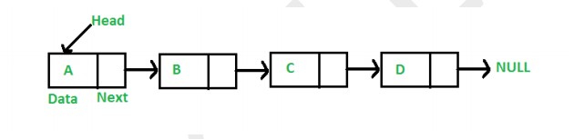

## EXPERIMENT NO - 7

**Title:** Write a class to implement Linked List

**Objectives:**

1. To understand implementation of Linked list

**Key Concepts:** Node, head, data, next

**Theory:**

A linked list is a linear data structure, in which the elements are not stored at contiguous memory locations. The elements in a linked list are linked using pointers as shown in the below image:



In simple words, a linked list consists of nodes where each node contains a data field and a reference(link) to the next node in the list.

**Problem Statement:**

    Write a class for LinkedList.

**Program Analysis:**

Write a node class as

```c++
class Node
{
    public:
    int data;
    Node *next;

    Node()
    {
        next = NULL;
    }
}
```

create class LinkedList

_Member variable:_

    Node *head;

_Member functions:_

    Constructor - non parameterised - set head to NULL in constructor
    Destructor - to delete dynamicaly allocated memory
    createNode
    initializeNode
    All attach methods
    All detach methods
    Travese

### Solution

- [Node.h](#Node.h)
- [Node.cpp](#Node.cpp)
- [LinkedList.h](#LinkedList.h)
- [LinkedList.cpp](#LinkedList.cpp)
- [main.cpp](#main.cpp)

##### [Node.h](https://raw.githubusercontent.com/mr-compilerMS/DKTE_CSE/master/4th_Semester/OOD/Experiment_No_7/Node.h)

```c++
class Node
{
public:
    int data;
    Node *next;
    Node();
};
```

##### [Node.cpp](https://raw.githubusercontent.com/mr-compilerMS/DKTE_CSE/master/4th_Semester/OOD/Experiment_No_7/Node.cpp)

```c++
#include <iostream>
#include "Node.h"

Node::Node()
{
    this->next = NULL;
}
```

##### [LinkedList.h](https://raw.githubusercontent.com/mr-compilerMS/DKTE_CSE/master/4th_Semester/OOD/Experiment_No_7/LinkedList.h)

```c++
#include "Node.h"

class LinkedList
{
private:
    Node *head;

public:
    LinkedList();
    ~LinkedList();
    int attachAtBegin();
    int attachAfter(int data);
    int attachAtEnd();
    int detachFromBegin();
    int detachFromEnd();
    int detachGiven(int data);
    void traverse();
    void deleteList();

private:
    Node *createNode();
    int initalizeNode(Node *n);
};

```

##### [LinkedList.cpp](https://raw.githubusercontent.com/mr-compilerMS/DKTE_CSE/master/4th_Semester/OOD/Experiment_No_7/LinkedList.cpp)

```c++
#include <iostream>
#include "LinkedList.h"
using namespace std;
LinkedList::LinkedList()
{
    this->head = NULL;
}

int LinkedList::initalizeNode(Node *n)
{
    cout << "\nEnter Data : ";
    cin >> n->data;
    return 1;
}

int LinkedList::attachAtBegin()
{
    Node *temp;
    temp = this->createNode();
    if (temp != NULL)
    {
        initalizeNode(temp);
        if (this->head == NULL)
            this->head = temp;
        else
        {
            temp->next = head;
            head = temp;
        }
        return 1;
    }
    return 0;
}

int LinkedList::detachFromBegin()
{
    Node *temp;
    temp = head;
    if (head != NULL)
    {
        head = head->next;
        int data = temp->data;
        free(temp);
        return data;
    }
    else
    {
        return 0;
    }
}
int LinkedList::detachFromEnd()
{
    Node *temp, *prev;
    temp = prev = head;
    int data = 0;
    if (head != NULL)
    {
        if (head->next == NULL)
        {
            data = head->data;
            free(head);
            head = NULL;
        }
        else
        {
            while (temp->next != NULL)
            {
                prev = temp;
                temp = temp->next;
            }
            data = temp->data;
            free(temp);
            prev->next = NULL;
        }
    }
    return data;
}
int LinkedList::detachGiven(int data)
{
    if (head == NULL)
        return 0;
    Node *temp, *prev;
    temp = prev = head;
    if (head->data == data)
    {
        head = head->next;
        free(temp);
    }
    else
    {
        while (temp->data != data)
        {
            prev = temp;
            temp = temp->next;
            if (temp == NULL)
                break;
        }
        if (temp == NULL)
        {
            data = 0;
        }
        else if (temp->data == data)
        {
            prev->next = temp->next;
            free(temp);
        }
    }
    return data;
}

int LinkedList::attachAfter(int data)
{
    Node *temp;
    temp = head;
    if (head == NULL)
    {
        cout << "\nSearch data not found..";
        return 0;
    }
    while (temp->data != data)
    {
        temp = temp->next;
        if (temp == NULL)
            break;
    }
    if (temp == NULL)
    {
        cout << "\nSearch data not found..";
        return 0;
    }
    else
    {
        Node *t;
        t = this->createNode();
        if (t != NULL)
        {
            this->initalizeNode(t);
            t->next = temp->next;
            temp->next = t;
            return data;
        }
    }
    return 0;
}

int LinkedList::attachAtEnd()
{
    Node *temp, *temp2;
    temp = this->createNode();
    if (temp != NULL)
        if (initalizeNode(temp))
        {
            temp2 = head;
            if (this->head == NULL)
            {
                head = temp;
                cout << endl
                     << "Attached at end successfully";
            }
            else
            {
                while (temp2->next != NULL)
                {
                    temp2 = temp2->next;
                }
                temp2->next = temp;
                cout << endl
                     << "Attached at end successfully";
            }
        }
        else
            return 0;
    return 1;
}

void LinkedList::traverse()
{
    Node *temp;
    temp = head;
    if (temp == NULL)
    {
        cout << "\n\nList is empty.";
        return;
    }
    cout << "\n\nTraversing :";
    while (temp != NULL)
    {
        cout << "\t" << temp->data;
        temp = temp->next;
    }
}

Node *LinkedList::createNode()
{
    //return new Node();
    Node *n;
    n = (Node *)malloc(sizeof(Node));
    n->next = NULL;
    return n;
}

LinkedList::~LinkedList()
{
    Node *temp;
    while (head != NULL)
    {
        temp = head;
        head = head->next;
        free(temp);
    }
}

void LinkedList::deleteList()
{
    Node *temp;
    while (head != NULL)
    {
        temp = head;
        head = head->next;
        free(temp);
    }
}
```

##### [main.cpp](https://raw.githubusercontent.com/mr-compilerMS/DKTE_CSE/master/4th_Semester/OOD/Experiment_No_7/main.cpp)

```c++
#include "LinkedList.h"
#include "iostream"
using namespace std;

int main()
{
    LinkedList l;
    int choice = 0;
    int data;
    while (choice != 10)
    {
        cout << endl
             << "Menu:\n\t1. Attach at begin\n\t2. Attach after\n\t3. Attach at  end" << endl
             << "\t4. Detach from begin\n\t5. Detach given\n\t6. Detach from end" << endl
             << "\t7. Traverse\n\t8. Delete List\n\t10. Exit\n\nEnter Your Choice :";
        cin >> choice;
        switch (choice)
        {
        case 1:
            l.attachAtBegin() ? cout << "\nInsert Successfull" : cout << "\nAn Error Occured";
            break;
        case 2:
            cout << "\nEnter data for search :";
            cin >> data;
            l.attachAfter(data) ? cout << "\nInsert Successfull" : cout << "\nAn Error Occured";
            break;
        case 3:
            l.attachAtEnd() ? cout << "\nInsert Successfull" : cout << "\nAn Error Occured";
            break;
        case 4:
            data = l.detachFromBegin();
            data ? cout << "\n"
                        << data << "Deleted"
                 : cout << "\nAn Error Occured";
            break;
        case 5:
            cout << "Enter data to delete :";
            cin >> data;
            l.detachGiven(data) ? cout << "\n"
                                       << data << "Deleted"
                                : cout << "\nAn Error Occured";
            break;
        case 6:
            data = l.detachFromEnd();
            data ? cout << "\n"
                        << data << "Deleted"
                 : cout << "\nAn Error Occured";
            break;
        case 7:
            l.traverse();
            break;
        case 8:
            l.deleteList();
            break;
        default:
            break;
        }
    }
    return 0;
}

```
