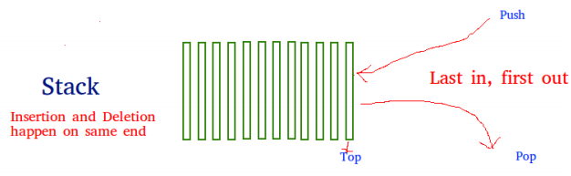
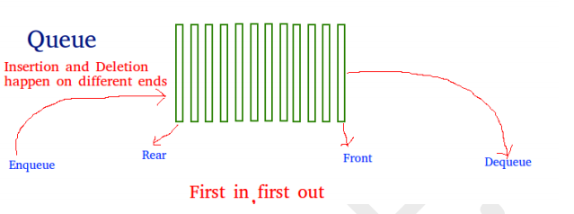

## EXPERIMENT NO - 8

**Title:** Write a program to implement data structure Stack and Queue.

**Objectives:**

1. To learn the concept of Stack.
2. To learn the concept of Queue.

**Key Concepts:** Stack, Queue

**Theory:**

**Stack :**

Stack is a linear data structure which follows a particular order in which the operations are
performed. The order may be **LIFO(Last In First Out)** or **FILO(First In Last Out)**.

There are many real-life examples of a stack. Consider an example of plates stacked over one
another in the canteen. The plate which is at the top is the first one to be removed, i.e. the plate which has been placed at the bottommost position remains in the stack for the longest period of time. So, it can be simply seen to follow LIFO(Last In First Out)/FILO(First In Last Out) order.

**Queue:**

A Queue is a linear structure which follows a particular order in which the operations are
performed. The order is **First In First Out (FIFO)**. A good example of a queue is any queue of consumers for a resource where the consumer that came first is served first. The difference
between stacks and queues is in removing. In a stack we remove the item the most recently
added; in a queue, we remove the item the least recently added.

**Problem Statement:**

Write a Linked List based Stack and Queue classes.

**Program Analysis:**

Use Linked List object to store elements of Stacks and Queues

Provide following public operations on Stack

    push(data)
    pop - return stacked data.
    push and pop should internally use linked list members to complete the functionality

similarly create Queue class

Demonstrate the use of Stack and Queue.

