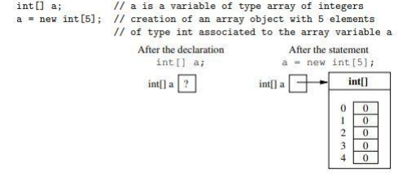

# Experiment No. : 02

**Title:** Write a program to implement matrix operations.

**Objectives:**

1. To learn arrays in java.

**Theory:**

**Arrays:**

An array object (or simply array) contains a collection of elements of the same type, each of
which is indexed (i.e., identified) by a number.

A variable of type array contains a reference to an array object.

**Creating arrays:**

To use an array in Java we have to:

1. Declare a reference variable of type array that allows us to refer to an array object;
2. Construct the array object specifying its dimension (number of elements of the
   array object);
3. Access the elements of the array object through the array variable in order to assign
   or obtain their values (as if they were single variables).

**Declaration of array object reference variables:**

To use an array we first have to declare a variable that refers to the array.
Syntax:

    type [] arrayName ;

where,

• type is the datatype of the elements of the array to which the variable we are
declaring will refer.

• arrayName is the name of the array variable we are declaring.

**Semantics:**

Declares a variable arrayName that can refer to an array object with elements of type type .

**Example:**

    int[] a; // a is a variable of type reference to an array of integers

Note that, by declaring a variable of type reference to an array we have not yet constructed
the array object to which the variable refers, and hence the array cannot be used yet.

**Creation of an array object:**

To use an array, we must first create it, by specifying the number of elements it should have.

**Syntax:**

    new type [size of dimension ]

where,
• **type** is the name of the type of the elements of the array object that we want to
construct
• **Size** of dimension is an expression of type int that evaluates to a positive (or zero)
value and that specifies the length of dimension of the array.

**Note:** For multi-dimensional arrays, multiple such sizes of dimensions need to be declared
Such as,

    new type [size of dimension1 ] [size of dimension2 ] […] […]

**Semantics:**

Creates an array object with dimension elements of type type and returns a reference to the
created object.

The elements of the array are indexed from 0 to arraylength -1, and each one is initialized to
the default value for type.

Declaration of array variable and creation of an array object can be done in a single statement
such as,

    type [] arrayName = new type [size of dimension];

OR

    type [] arrayName = new type [size of dimension]{value1,value2, …valueN};

**Example:**


After we have created an array object associated to an array variable, it is possible to access
the single elements of the collection contained in the array. These elements are initialized to
the default value for the type (for integers, it is 0, as illustrated in the figure).

**Accessing the elements of an array:**

Each single element of an array object can be accessed as if it were a separate variable.

Syntax:

    arrayName [index]

where,

• arrayName is the name of the array variable that contains a reference to the array
we want to access

• index is an expression of type int with non-negative value that specifies the index of
the element we want to access.

**Semantics:**

Accesses the element of the array arrayName in the position specified by index to read or
modify it.

If the array arrayName contains N elements, the evaluation of the expression index must
return an integer in the interval [0, N − 1]; if this is not the case, a runtime error occurs when
the program is run.

**Matrix (array of arrays):**

A matrix is a collection of elements of the same type, organized in the form of a table. Each
element is indexed by a pair of numbers that identify the row and the column of the element.

A matrix can be represented in Java through an array, whose elements are themselves
(references to) arrays representing the various rows of the matrix.

**Declaration of a matrix**

A matrix is declared in the following way (as an array of arrays):

```java
    int[][] m; // declaration of an array of arrays (matrix) m
```

**Creation of a matrix**

As for arrays, before a matrix can be used, it must be created.

```java
    e.g. m = new int [3][5];
```

OR

Alternative way of creation of a 3x5 matrix accessible through the variable m:

```java
    // creation of an array object of 3 elements,
    // each of which will contain the reference to a row of the matrix
    m = new int[3][];
    m[0] = new int[5]; // creation of row 0 of the matrix (5 columns)
    m[1] = new int[5]; // creation of row 1 of the matrix (5 columns)
    m[2] = new int[5]; // creation of row 2 of the matrix (5 columns)
```

Note that, by creating the rows one at a time, it is also possible to have rows with different
dimensions. This would correspond to a matrix with an irregular shape. This is type of array
called Jagged/Ragged array.

**Accessing elements:**

```java
for(int i=0; i<m.length; i++)
{
    for(int j=0; j<m[i].length; j++)
    {
        System.out.println(“m=”+m[i][j]);
    }
}
```

**Keywords:** array, matrix

**Algorithm:**

1. Define Matrix class instance variables & methods for addition, substraction, matrix
   multiplication, division, scalar multiplication, transpose etc.
2. Define class MatrixTest with two objects of Matrix class.
3. Call the methods for addition, subtraction, matrix multiplication, division, scalar
   multiplication, and transpose with help of that object.
4. Print the results.

**_Note: Please follow the naming conventions while writing the program._**
